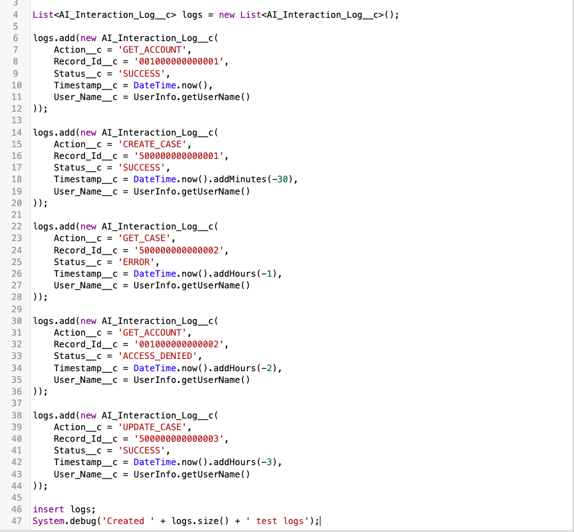
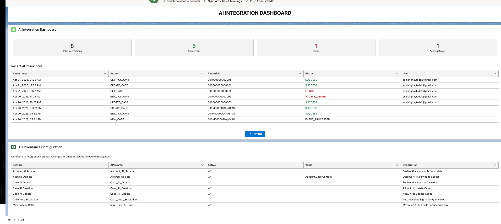

# Secure AI-to-Salesforce Integration Platform

## Project Overview
A secure Salesforce integration platform that enables AI-driven case handling with strict multi-tenant data isolation, governance controls, audit logging, and admin configuration. Built on Salesforce using Apex, LWC, Platform Events, and Custom Metadata.

## Architecture
```
External AI System
        │
        ▼
  OAuth 2.0 Auth
        │
        ▼
┌─────────────────────────────┐
│   Apex REST Endpoints       │
│   (CRUD/FLS Security)       │
├─────────────────────────────┤
│   AI Service Layer          │
│   (Business Logic)          │
├─────────────────────────────┤
│   Platform Events           │
│   (Async Processing)        │
├─────────────────────────────┤
│   Audit Logging             │  ◄── AI_Interaction_Log__c
│   (Every AI Interaction)    │
├─────────────────────────────┤
│   Governance Controls       │  ◄── AI_Config__mdt
│   (Admin Configuration)     │
├─────────────────────────────┤
│   Security Layer            │
│   (with sharing, OWD,       │
│    Profiles, Perm Sets)     │
└─────────────────────────────┘
        │
        ▼
  LWC Admin Dashboard
  (Monitor + Configure)
```

## Tech Stack
- **Backend:** Apex (REST Services, Triggers, Batch, Test Classes)
- **Frontend:** Lightning Web Components (LWC)
- **Security:** OAuth 2.0, CRUD/FLS Checks, with sharing, OWD
- **Async:** Platform Events
- **Config:** Custom Metadata Types
- **Logging:** Custom Objects
- **DevOps:** SFDX, Git, VS Code
- **Testing:** Apex Test Classes (95%+ coverage)

## Setup Instructions

### 1. Create Developer Org
- Sign up at: https://developer.salesforce.com/signup

### 2. Clone This Repo
```bash
git clone https://github.com/ashishghaytadak/salesforce-ai-integration-platform.git
cd salesforce-ai-integration-platform
```

### 3. Authorize Org
```bash
sfdx auth:web:login -a AIProject
```

### 4. Deploy to Org
```bash
sfdx force:source:deploy -p force-app/main/default -u AIProject
```

### 5. Assign Permission Set
```bash
sfdx force:user:permset:assign -n AI_Integration_Admin -u AIProject
```

### 6. Load Sample Data
```bash
sfdx force:data:tree:import -p data/sample-data-plan.json -u AIProject
```

## Project Structure
```
force-app/main/default/
├── classes/
│   ├── AIAccountService.cls          # REST endpoint for Accounts
│   ├── AICaseService.cls             # REST endpoint for Cases
│   ├── AIInteractionLogger.cls       # Audit logging service
│   ├── AIGovernanceService.cls       # Governance & config checks
│   ├── AISecurityService.cls         # CRUD/FLS security checks
│   ├── AICaseEventSubscriber.cls     # Platform Event handler
│   ├── AIAccountServiceTest.cls      # Test class
│   ├── AICaseServiceTest.cls         # Test class
│   ├── AIInteractionLoggerTest.cls   # Test class
│   ├── AIGovernanceServiceTest.cls   # Test class
│   └── AICaseEventSubscriberTest.cls # Test class
├── lwc/
│   ├── aiDashboard/                  # Main dashboard component
│   ├── aiInteractionLog/             # Log viewer component
│   └── aiConfigPanel/                # Admin config component
├── objects/
│   ├── AI_Interaction_Log__c/        # Audit log custom object
│   └── AI_Case_Event__e/            # Platform Event
├── customMetadata/
│   └── AI_Config__mdt/              # Governance configuration
└── permissionsets/
    └── AI_Integration_Admin.permissionset-meta.xml
```

## Features
- ✅ Secure REST API endpoints with CRUD/FLS enforcement
- ✅ OAuth 2.0 authentication via Connected Apps
- ✅ Multi-tenant data isolation (with sharing + OWD)
- ✅ Platform Event-driven async processing
- ✅ Comprehensive audit logging
- ✅ Admin-configurable governance controls
- ✅ LWC dashboard for monitoring
- ✅ 95%+ test coverage

## Screenshots
### Dashboard View


### Configuration / Logs View


## Author
**Ashish Ghaytadak**
- LinkedIn: linkedin.com/in/ashishghaytadak
- Email: ashishghaytadak@gmail.com
- Certifications: PD1, Admin, App Builder, Agentforce Specialist
